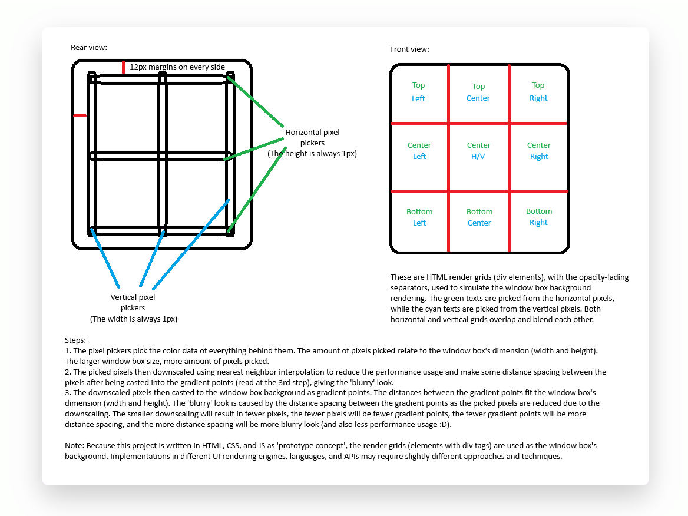
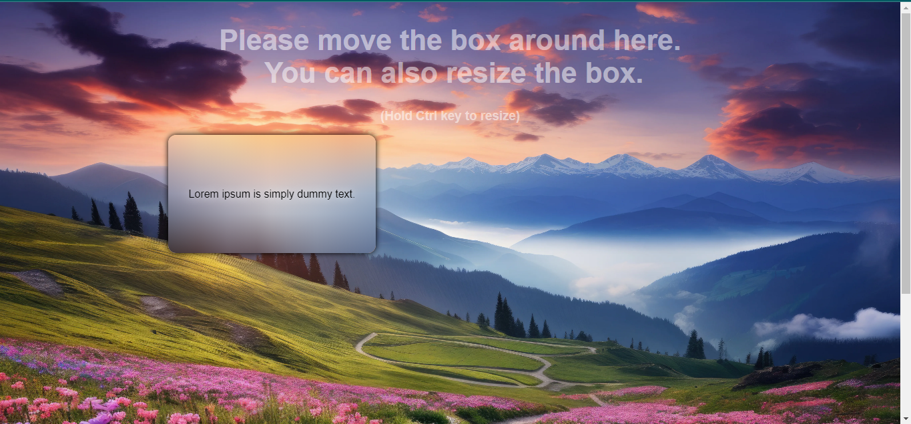
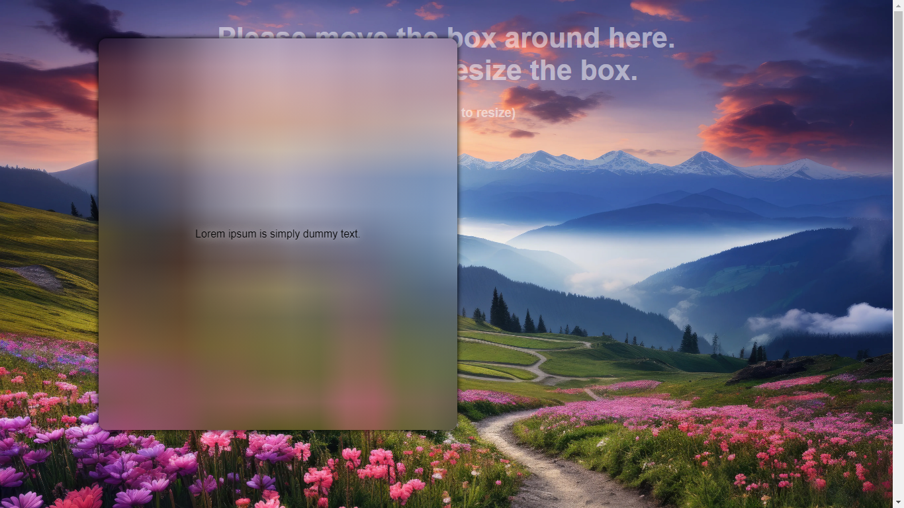

# Dynamic Gradient Panel - The Glassmorphism Alternative for UI Design
This project method is the closest alternative to the Glassmorphism trend (which the window box background blends with everything behind it using the Gaussian Blur filter) for UI design. This project has quite similar effect to Glassmorphism. However, unlike the conventional Glassmorphism one that uses Gaussian Blur, this doesn't need much computations which heavily impact the performance and consume much power.

## Advantages
- Performance-Friendly
- Lightweight
- Cross-Platform
- Flexible
- Power Saving

## How it works
This project method works by creating the color gradient effects as the window box background, and the gradient colors dynamically changing when moved or resized by picking the real-time colors behind the window box using the 'pixel pickers', then the picked pixels are downscaled using nearest neighbor before being rendered to the window box's background by casting the pixels as gradient points (the gradient points count the same as the downscaled pixels).\
**For further explanation, look at the following mechanism below.**

## Screenshots

## Glassmorphism History Timeline
- **Early 2000s** -> Exclusively used in video game UIs for consoles (PS2, GameCube, Xbox)
- **2006** -> Microsoft's Windows Vista Aero glass theme
- **2013** -> Apple's iOS 7 theme
- **2015** -> Windows 10 Fluent theme
- **2017 to 2020s** -> massive usages in websites being skyrocketed (CSS Backdrop-filter:blur)
- **2024** -> Replaced by the relatively more lightweight and power-saving method, which uses gradient manipulations instead of the heavy gaussian blur filter algorithm

## FAQ
### 1. How do I execute this project?
Copy this project's folder to "xampp/htdocs" directory, open the browser, and then type "localhost/dynamic-gradient-panel". If you don't have XAMPP, you need to install it first. This won't work if you open the index.html directly, because there will be something wrong with the CORS of the JS canvas (read the 4th question).

### 2. Does this project require internet connection?
Absolutely, of course. Though most functions, instructions, and values are already written locally inside the HTML and CSS files and do not rely with the internet connection, but those will not function properly without the internet, because this project still requires the external CSS and JS imported over CORS.

### 3. How does the Gaussian Blur used by the conventional Glassmorphism impact the performance and use so much power?
Gaussian Blur is a widely used image processing technique that smooths images by reducing noise and detail. However, it can be computationally intensive, impacting performance and power usage. Here are a few reasons why:
- Mathematical Complexity: Gaussian Blur involves convolving an image with a Gaussian kernel, which requires calculating a weighted average for each pixel based on its neighbors. This process is mathematically intensive, especially for larger kernels.
- High Computational Load: The convolution operation needs to be performed for every pixel in the image. For high-resolution images, this means millions of calculations, which can be demanding on the CPU or GPU.
- Memory Usage: Storing the Gaussian kernel and intermediate results during the convolution process can consume significant memory, especially for large images or high-resolution video frames.
- Power Consumption: The intensive computations and memory operations required for Gaussian Blur can lead to higher power consumption, particularly on mobile devices or systems with limited resources.

### 4. Why does the translucent background not sync with the actual background if I resize the browser's window or entering fullscreen?
This project is still under development, so that the render might not be as good as expected yet. And provisionally, developer uses the pre-captured HTML body screenshot drawn into the JS canvas to perform blend with the 'pixel pickers' behind the window box as 'prototype concept' (not final implementation), because this project is specialized for the web, desktop/mobile app, video game, and/or operating system UI designers and/or developers who wish to achieve such aesthetic whilst also maintaining the power usage and performance. If you want more real-time rendering, developer might need extra libraries, more time, more knowledge, and more complicated source code to implement it. You can wait for the updates of this project development.  

### Send your feedback to this email: kutukepik04@gmail.com  

Background image source: https://i0.wp.com/picjumbo.com/wp-content/uploads/beautiful-nature-mountain-scenery-with-flowers-free-photo.jpg 
(Accessed at September 2nd 2024)
